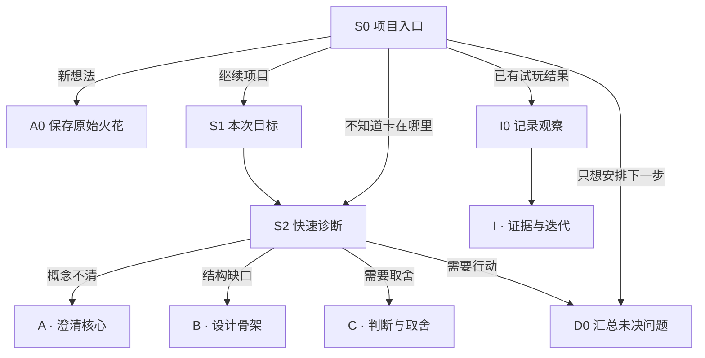
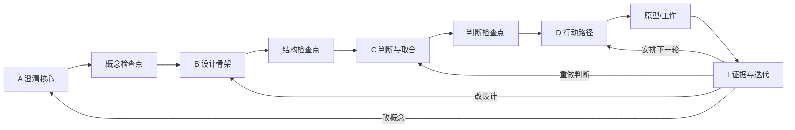

# CreatorEngine 对话树与节点规格设计

> 版本：V1.0  
> 日期：2026-08-14  
> 设计对象：本地、规则驱动的游戏创作引擎  
> 设计依据：[游戏设计框架研究报告](./game-design-frameworks-research.md) 与现有 CreatorEngine 六步流程  
> 本文范围：信息架构、对话路由、逐节点内容、输入约束、判断规则、产出物和实现优先级；不包含本轮 UI 代码实现。

## 一、产品决定

CreatorEngine（下称 CE）保留四项核心职责，但将它们组织成一条可迭代的设计闭环：

| CE 的职责 | 对话阶段 | 阶段产物 | 完成标志 |
|---|---|---|---|
| 1. 澄清、丰富最初想法 | A · 澄清核心 | `ConceptBrief` 概念简报 | 能说清玩家身份、核心动作、目标、张力和体验承诺 |
| 2. 给出构思框架和流程，强迫思考补充 | B · 建立设计骨架 | `DesignSkeleton` 设计骨架 | 有项目支柱、玩家循环、关键选择和设计→动态→体验因果链 |
| 3. 给出参考和框架，辅助确认可行性并做好判断 | C · 判断与取舍 | `DecisionSheet` 判断单 | 知道参考对象、约束、关键假设、主要风险、可选方向和选择理由 |
| 4. 列出重点问题和工作路径，说明还可做什么 | D · 形成行动路径 | `ActionMap` 行动图 | 有按优先级排序的问题、最小原型、验证信号、近期任务和备选路径 |

四阶段不是一次性漏斗。试玩后进入 I · 证据与迭代，再根据证据回到 A、B、C 或 D。**导出方案不是终点，下一项可验证工作才是终点。**

### 1.1 对话树不是一张巨型表单

对话树由四部分组成：

1. **主干节点：** 所有项目都应回答的最少问题；
2. **诊断路由：** 根据已知信息、矛盾和风险决定下一问；
3. **专项模块：** 只在叙事、经济、关卡、多人或严肃游戏确实重要时展开；
4. **证据回路：** 把原型观察变成保留、修改、替换或继续验证的决定。

### 1.2 “强迫思考”的准确含义

CE 不强迫用户假装知道答案，但不能无痕跳过关键问题。每个关键节点必须以一种方式结束：

- **回答：** 提交当前决定；
- **假设：** 暂用这个答案，但明确标记为未验证；
- **不适用：** 选择原因，并记录设计边界；
- **延期：** 说明何时/用什么证据再回答，自动进入未决问题列表。

这样既能迫使用户面对问题，又不会把未知伪装成事实。

## 二、整体信息架构

### 2.1 三种工作深度

| 深度 | 用途 | 必经节点 | 预计结果 |
|---|---|---|---|
| 快速梳理 | 第一次捕捉或 15–25 分钟工作坊 | S0、A0、A1、A3、A6、A7、B1、B2、B6、C7、D2、D6 | 一页概念 + 最大风险 + 下一步 |
| 标准设计（默认） | 独立游戏/原型立项 | 全部主干节点，专项按需 | 完整四阶段产物 |
| 深入检查 | 进入制作、遇到瓶颈或团队评审 | 主干 + 所有命中的专项与证据节点 | 风险、影响、验证与版本记录 |

深度只决定默认展开量，不锁死能力。快速模式中发现高风险冲突时，仍可被建议进入深入节点。

### 2.2 五种入口



### 2.3 主闭环



## 三、每个对话节点的统一结构

现有界面的“左侧设计路径—中央对话—右侧当前状态”可以保留，但中央节点和右侧状态需要升级。

### 3.1 中央节点固定展示顺序

1. **位置：** 阶段、节点编号、此节点解决的问题；
2. **为何现在问：** 一句话说明它与用户已有答案的关系；
3. **已知上下文：** 引用 1–3 条相关答案，可点回编辑；
4. **主问题：** 一次只承担一个认知任务；
5. **输入区：** 选择、排序、短填空、结构表或连接图；
6. **参考抽屉：** 框架说明、例子、反例、适用边界，默认收起；
7. **CE 回看：** 展示缺失、冲突或推导，不替用户做最终决定；
8. **决策动作：** 确认、标为假设、不适用、延期、比较其他方向；
9. **下一步预告：** 说明下一问以及为什么走那里。

### 3.2 全局可用操作

- `返回上一问`：不丢失后续数据，受影响节点标记“需要复核”；
- `查看设计地图`：从对话切到节点关系图；
- `查看依据`：展开框架、例子和限制；
- `我不知道`：创建未知项，并给出“看例子 / 比较方向 / 标为假设 / 延后验证”；
- `不适用`：必须选择原因；
- `保存当前草稿`：允许不完整退出；
- `接受并继续`：完成当前节点；
- `比较其他选择`：进入候选方案节点，不覆盖原答案；
- `重新打开`：已完成节点可随时重做。

### 3.3 右侧“当前设计状态”

右侧不再只是答案列表，应显示五种状态：

- **已决定：** 当前采用的设计；
- **假设：** 暂时相信但没有证据；
- **冲突：** 两项决定互相削弱；
- **未决：** 已延期的问题；
- **有证据：** 经原型观察支持或反驳的判断。

顶部持续显示三个数字：`主干完成度`、`高风险未知项`、`需要复核的决定`。完成度不能掩盖风险；即使 95% 的字段已填，也可能有一个阻断制作的高风险未知项。

### 3.4 输入类型

| 类型 | 用途 | 约束 |
|---|---|---|
| 单选/多选卡 | 选择 Fantasy、动机、风险类型等 | 单屏不超过 7 个首层选项；更多内容分组 |
| 结构化填空 | 身份、动作、目标、约束等 | 每格一个概念，防止写成长篇混合答案 |
| 自由文本 | 原始火花、设计理由、观察 | 提供建议长度，不以字数代替质量 |
| 排序 | 支柱、风险、问题优先级 | 最多排序 5 项；先选再排 |
| 二维矩阵 | 影响×不确定、价值×成本 | 必须允许“不确定”而非强行给数字 |
| 关系连接 | 机制→动态→体验、动作→反馈 | 每条边要求一句因果理由 |
| 时间路径 | 原子/会话/进展循环、近期工作 | 每步必须有状态变化或可检查结果 |

## 四、路由与判断规则

### 4.1 路由优先级

CE 每次完成节点后按以下顺序决定下一步：

1. 用户明确选择的目标；
2. 当前节点产生的阻断性缺口；
3. 高影响且高不确定的冲突/风险；
4. 当前阶段尚未完成的主干节点；
5. 命中的专项模块；
6. 阶段检查点；
7. 默认进入下一阶段。

### 4.2 三档反馈，不滥用“错误”

| 等级 | 含义 | 行为 |
|---|---|---|
| 阻断 | 缺少后续无法成立的信息 | 必须回答、标为假设、不适用或延期 |
| 建议 | 存在模糊、重复或潜在矛盾 | 可以继续，但生成未决项 |
| 提醒 | 参考性启发，不影响流程 | 只在右侧或参考抽屉显示 |

### 4.3 规则驱动也能完成的判断

P0 不需要 AI。通过结构化字段和确定性规则即可判断：

- 核心句是否缺身份、动词、目标或约束；
- 主导动词是否超过 2 个；
- 每层循环是否有行动、状态变化、反馈和下一次决策；
- 每条体验是否有动态和具体设计元素支持；
- 项目支柱是否包含“做/不做/证明”；
- 资源是否只有来源没有消耗，或只有消耗没有来源；
- 最高风险是否有原型问题和可观察信号；
- 高成本任务是否没有支柱或风险依据；
- 修改上游答案后，哪些下游节点需要复核。

## 五、入口节点规格

| ID / 节点 | 中央展示与主问题 | 输入、选项或填入要求 | 判断、产出与下一跳 |
|---|---|---|---|
| **S0 项目入口** | 展示最近项目、更新时间、四阶段状态。问：“这次从哪里开始？” | `开始一个新想法`、`继续当前项目`、`诊断我卡在哪里`、`录入一次试玩`、`只安排下一步`；新项目填写临时名称，可稍后改 | 新项目→A0；继续→S1；诊断→S2；试玩→I0；计划→若无概念先 A0，否则 D0 |
| **S1 本次目标** | 展示上次停留点、未决项和高风险项。问：“这次希望推进到什么结果？” | 单选：`把想法说清`、`补全玩法结构`、`判断一个方案`、`制定工作路径`、`继续上次`；可选择工作深度 | 记录 `sessionGoal`；若用户目标存在前置缺口，说明原因后先补最短前置节点；否则直达目标阶段 |
| **S2 快速诊断** | 以 6 张陈述卡问：“哪一句最像现在的状态？” | `只有题材/画面`、`有很多机制但不成体系`、`不知道为谁做`、`几个方向无法取舍`、`担心做不出来`、`不知道下一步`；可多选并排序 | 结合已有字段生成 1–3 个缺口；用户确认首要缺口。路由 A1/B0/C0/D0；其他缺口进入 backlog |

## 六、A 阶段：澄清与丰富最初想法

### 6.1 阶段目标

把“我脑中有个东西”变成可继续设计、但仍保留作者火花的 `ConceptBrief`。这个阶段不讨论大量功能和制作计划。

### 6.2 节点规格

| ID / 节点 | 中央展示与主问题 | 输入、选项或填入要求 | 判断、产出与下一跳 |
|---|---|---|---|
| **A0 保存原始火花** ★ | 标题“先把脑海里的东西原样留下”。提示动作、画面、关系、题材或规则均可 | 自由文本 1–800 字；快捷起句：`反复___会很好玩`、`我想成为___`、`我脑中有个画面___`、`如果把___改成___`；可语义不完整 | 只要求非空，不重写原文；保存 `rawIdea` 和版本。→A1 |
| **A1 不可失去的火花** ★ | 引用原始想法。问：“如果最后只能保住一件事，你最不愿失去什么？” | 单选类别：`动作/手感`、`玩家身份`、`关系`、`世界条件`、`情绪`、`问题/主题`、`其他`；再填 1–2 句具体说明 | 必须只选一个主火花；可再记 2 个次要元素。保存 `spark`、`protectedElement`。→A2 或快速模式→A3 |
| **A2 玩家身份 / Fantasy** | 问：“玩家在行动中把自己想成谁，或相信自己能做到什么？”展示现有 8 类 Fantasy 但不把它们当类型标签 | 单选：成为、掌握、力量、发现、创造、照顾、共同经历、转变；必须补完项目专属句；可选“身份不重要，主要是纯操作/观察”并说明 | 输出 `playerFantasy` 和 `playerRole`。如果选择社交→标记多人专项；若纯操作→允许身份为空。→A3 |
| **A3 核心动作** ★ | 问：“玩家最常、最有意义地反复做什么？”显示“写玩家做什么，不写系统拥有什么” | 填 1 个主导动词 + 对象；可增加最多 2 个辅助动词；选动作性质：操作、选择、规划、沟通、探索、创造、照顾、推理 | 阻断：主导动词为空；建议：动词超过 2 个、填写“探索感/开放世界”等名词。输出 `coreAction`。→A4 |
| **A4 目标与可见变化** | 问：“玩家为什么做这个动作？做成后什么状态会改变？” | 填短期目标、长期方向（二者可相同）、成功后的状态变化；可选 `自定目标/无固定胜利` 并说明玩家如何判断进展 | 阻断：既无目标也无自定进展标准。输出 `goal`、`outcomeState`。→A5 |
| **A5 张力、约束或反转** | 问：“什么让这个动作不只是机械重复？”展示约束示例而非答案 | 单选主来源：资源、时间、空间、信息、风险、关系、规则反转、不可逆结果、操作难度；补完“玩家想___，但必须___”；可选“暂未找到”→假设 | 检查约束是否改变决策，而非只换题材。输出 `centralTension`、`constraintType`；未知则建立 issue。→A6 |
| **A6 核心玩法句** ★ | 并列展示 A2–A5，提供实时组句：“玩家作为［身份］，反复［动作］，以［目标］；但［约束］。”问：“这句话准确吗？” | 四格可直接改；动作居中版本、身份居中版本、世界条件居中版本三种句式可切换；操作：`采用`、`自己重写`、`比较 2 个版本` | 必须保留结构化字段；自由重写不覆盖原字段。输出 `conceptSentence`。→A7 |
| **A7 体验承诺** ★ | 问：“如果设计成立，玩家在什么时刻会感到什么？”不把“美术风格”当体验 | 选择最多 2 个主体验 + 1 个明确不追求的体验；补完“当玩家___时，希望他感到___，证据可能是___”；可参考 MDA、Four Keys、PENS 词卡 | 体验必须绑定场景/行为；“沉浸/好玩”单独出现时给建议。输出 `experiencePromise`、`antiExperience`、首个 `observableSignal`。→A8 |
| **A8 概念检查点** | 展示一页概念卡：原始火花、核心句、体验承诺；同时显示“已确定/假设/未决” | 选择：`概念准确，建立设计骨架`、`回到某一项修改`、`先比较另一个概念方向`、`先判断可行性`、`先形成快速行动计划` | 生成 `ConceptBrief v1`。标准→B0；比较→C8 候选方向；可行性→C4；快速计划→D0 |

★ 表示快速梳理模式必经节点。

## 七、B 阶段：建立构思框架并强迫补充

### 7.1 阶段目标

把概念展开为能运行、能产生目标体验的 `DesignSkeleton`。框架名放在参考抽屉里，主界面用普通语言提问。

### 7.2 节点规格

| ID / 节点 | 中央展示与主问题 | 输入、选项或填入要求 | 判断、产出与下一跳 |
|---|---|---|---|
| **B0 结构诊断** | 展示概念句并问：“要让它真的可玩，现在最缺哪一层？” | 系统检查后显示：项目原则、瞬间玩法、关键选择、一局结构、长期变化、规则边界、体验因果；用户确认优先顺序 | 如果新项目按 B1→B8；已有项目先跳最高缺口，完成后回 B0 复检 |
| **B1 项目设计支柱** ★ | 问：“未来出现冲突时，哪 2–4 条原则决定取舍？”强调不是叙事/机制/美学/技术四分类 | 每条填写：名称、玩家承诺、我们会做、明确不做、如何看出成立；创建 2–4 条并排序 | 阻断：少于 2 条；建议：只有形容词、没有不做或证明。输出 `designPillars[]`。→B2 |
| **B2 原子玩家循环** ★ | 问：“在 5–30 秒里，玩家如何完成一次有意义的循环？” | 排列 3–6 步；每步填：感知/信息、玩家决定、动作、系统状态变化、反馈；标记回到哪一步 | 阻断：无决定、无状态变化或无反馈；建议：只有“行动→奖励”。输出 `atomicLoop`。→B3 |
| **B3 关键选择与权衡** | 从循环列出行动。问：“哪一次选择最能体现技巧或价值判断？” | 选择一个循环步骤；填写至少 2 个候选、各自收益/代价、玩家掌握的信息；可选 `主要是操作掌握` 并定义成功与失误反馈 | 检查是否存在显然最优且无代价选项；输出 `coreDecision` / `skillChallenge`。→B4 |
| **B4 会话/局面循环** | 问：“玩家在几分钟到一次游玩结束之间，怎样设定目标、面对变化并收束？” | 选择会话长度范围；填写进入条件、阶段/挑战、结果、下一局诱因；可选“作品不以局为单位”，改填章节/任务/自由游玩收束方式 | 输出 `sessionLoop`；若纯短篇且无长期结构，可跳 B5。→B5 |
| **B5 进展循环** | 问：“跨越多次行动或会话，什么会积累、解锁、损失或转变？” | 多选：玩家理解、能力、资源、内容、关系、身份、世界；每项填变化与新可能；可选 `没有长期进展` 并说明作品如何保持意义 | 若只有数值增加、没有新决策，给建议。输出 `progressionLoop` 或明确边界。→B6 |
| **B6 规则完整性检查** | 将已有答案自动映射到玩家、目标、程序、规则、资源、冲突、边界、结果八项，只追问空白 | 每个空白选择：`补充`、`由前文推导并确认`、`不适用`、`延期`；文本限制 1–3 条关键项，不写完整 GDD | 产出 `formalElements`；阻断项仅为玩家/作用主体、目标/自定方向、程序、规则边界、结果状态。→B7 |
| **B7 设计→动态→体验因果链** ★ | 左列已知规则/反馈，中列玩家可能形成的行为，右列体验承诺。问：“为什么这些设计会让玩家产生那个体验？” | 至少连接一条三段链；每条填写因果理由和反例条件；操作：`增加设计元素`、`改动态假设`、`改体验承诺` | 阻断：目标体验没有任何动态支持；建议：直接从美术/内容量跳到体验。输出 `causalChains[]`，状态为 hypothesis。→B8 |
| **B8 四类设计维度** | 将现有“叙事、机制、美学、技术”改称设计维度。问：“四类元素怎样共同支持前面的支柱与因果链？” | 每类写 1–3 个关键决定；叙事可选“系统结果自然形成”；每项必须关联至少一个支柱或因果链；无关联可标记为候选而非决定 | 输出 `designElements[]`；无关联的高成本项进入 C7 风险/质疑列表。→B9 |
| **B9 结构检查点与专项路由** | 展示循环图、因果图、Formal Elements 缺口和四维覆盖。问：“骨架是否足以进入判断？” | `进入判断与取舍`、`回到缺口`、`展开专项模块`、`保留未知并继续`；专项显示命中原因 | 生成 `DesignSkeleton v1`。默认→C0；按标签进入 N/E/L/M/V 专项；保留未知则写入 C7 |

## 八、C 阶段：参考、可行性与判断

### 8.1 阶段目标

CE 不替创作者宣布“这个游戏可行”，而是帮助创作者分清：

- 哪些是已知约束；
- 哪些只是有待测试的体验假设；
- 有哪些可借鉴或应避免的参考；
- 哪些方向互相冲突；
- 最大风险是什么；
- 为什么当前选择比其他选择更适合。

阶段产物是 `DecisionSheet`，不是一枚含糊的“可行”绿灯。

### 8.2 三层可行性目标

| 层级 | CE 能帮助确认什么 | 不能声称什么 |
|---|---|---|
| 概念可讨论 | 核心句、循环和体验因果是否自洽 | 玩家一定喜欢 |
| 原型可验证 | 最大风险能否被一个有限原型验证 | 整个产品能按期完成 |
| 制作可规划 | 技术、内容、团队、时间依赖是否已知并有路径 | 成本、市场和质量已经被证明 |

### 8.3 节点规格

| ID / 节点 | 中央展示与主问题 | 输入、选项或填入要求 | 判断、产出与下一跳 |
|---|---|---|---|
| **C0 判断焦点** | 展示当前假设、冲突和结构缺口。问：“这次最需要做出哪一种判断？” | 单选：`为谁做`、`参考什么`、`与同类有何不同`、`是否能做`、`多个方案选哪个`、`最大风险是什么`；标准流程从 C1 开始 | 记录 `decisionGoal`；允许直接跳对应节点，完成后回 C0 或进入 C10 |
| **C1 目标玩家与动机** | 引用体验承诺。问：“谁会主动寻求这种体验，他们为什么持续投入？” | 选择 1–2 个主导动机和 1 个明确不服务的动机；填写玩家已有经验、游玩情境、可接受的失败/学习成本；人口属性仅作补充 | 检查是否只写年龄/性别或“所有玩家”。输出 `audienceHypothesis`；若证据为空，状态为 hypothesis。→C2 |
| **C2 规则预期与参考对象** | 先问“玩家会用哪类游戏经验理解它？”，再问“有哪些作品、活动或设计模式能帮助判断，而不是只帮助模仿？” | 先选 1–2 个主类型/规则家族，可自定义或选择“尚不需要类型”；再添加 1–5 个参考，每项选择用途：核心动作、循环、动态、受众、视听、技术、商业/发行、反例 | 类型只表达规则预期，不因含升级/对白就自动归类；仅写游戏名不给结论时提示补充。输出 `genreExpectations`、`references[]`。→C3 |
| **C3 借鉴、避免与差异** | 三栏展示参考。问：“从每个参考中借什么、避开什么、在哪一点故意不同？” | 每个主参考至少填写一栏；差异化可选：规则、核心动作、身份视角、玩家关系、世界条件、节奏、混合结构、媒介技术；最终选 1 个主差异点 | 检查差异是否改变玩家决策/体验，而非只换皮。输出 `referenceDecisions`、`differentiationX`。→C4 |
| **C4 硬约束与成功边界** | 问：“哪些条件不可改变，做到什么程度才值得继续？” | 填平台/设备、单机/联机、团队能力、时间窗口、预算级别、内容规模、隐私/安全、发行条件；每项标记硬约束或偏好；填本轮成功边界 | 缺团队/时间/平台时不阻断概念，但会阻断“制作可规划”结论。输出 `constraints[]`、`feasibilityTarget`。→C5 |
| **C5 可行性分面** | 六张卡逐项问：“目前有什么依据？”分别为体验、系统、技术、内容、生产、市场/触达 | 每张卡选择：`已有依据`、`可低成本验证`、`高不确定`、`暂不相关`；填写证据/依赖/最小验证方式；可展开技术专项 | 生成分面状态，不合成虚假的单一分数。任何高影响“高不确定”进入 C7。→C6 |
| **C6 一致性与冲突检查** | CE 展示规则命中的矛盾，例如“轻松表达”与“高惩罚计时”、支柱“不做刷取”与长期循环“重复刷资源” | 对每条冲突选择：`修改前项`、`修改后项`、`允许张力并说明边界`、`需要原型判断`、`系统误报`；误报需简短理由 | 输出 `conflicts[]` 和处理状态；未解决高影响冲突→C7，已解决→C7 常规风险 |
| **C7 风险清单与排序** ★ | 汇总所有假设、延期项、冲突与约束。问：“什么最可能让整个方向不成立？” | 从体验、操作、系统、技术、内容、生产、受众、价值/安全中选最多 5 项；分别评估影响、未知程度、验证成本（低/中/高），再人工排序 | CE 推荐 `高影响×高未知` 优先，但用户可改并写理由。输出 `risks[]`、`topRisk`。→C8 或快速模式→D2 |
| **C8 候选方向与权衡** | 仅在用户要比较、存在冲突或 topRisk 有多种解法时出现。问：“至少还有哪两条可行路径？” | 创建 2–4 个候选；每项填核心改变、保留的火花、支持的支柱、代价、新风险、最快验证方式；可从触发卡生成结构，不自动宣判 | 阻断：只有一个方向却要求系统判断；输出 `options[]`。→C9 |
| **C9 做出当前判断** | 并列比较候选与“不决定”选项。问：“现在选哪条，依据是什么？” | 选择 `采用`、`暂用作工作假设`、`先并行验证两项`、`信息不足暂不决定`、`放弃这一方向`；必须填写依据、反证条件、复查时间/事件 | 输出可撤销的 `decision`；若并行验证，必须限定成本与结束条件。→C10 |
| **C10 判断检查点** | 展示目标玩家、参考、差异、约束、可行性分面、topRisk、当前决定 | `形成工作路径`、`回到风险/冲突`、`展开专项`、`导出判断单`、`保存后退出` | 生成 `DecisionSheet v1`。默认→D0；高风险专项→相应模块后返回 C7 |

## 九、D 阶段：重点问题和工作路径

### 9.1 阶段目标

把“还不知道什么”变成“接下来用什么最小工作换取最有价值的信息”。阶段产物 `ActionMap` 需要同时说明主路径、备选路径、停止条件和明确不做的工作。

### 9.2 节点规格

| ID / 节点 | 中央展示与主问题 | 输入、选项或填入要求 | 判断、产出与下一跳 |
|---|---|---|---|
| **D0 汇总未决问题** | 自动收集所有假设、延期、冲突、缺口、风险和专项建议。问：“是否还有系统没看到的重要问题？” | 用户可新增问题；每项选类别：设计、玩家/体验、技术、内容、生产、市场、价值/安全；可合并重复项 | 输出 `openQuestions[]`。若没有任何问题，CE 提醒检查是否把假设误标为事实。→D1 |
| **D1 问题分层** | 将问题放入“阻断下一步 / 重要但可后置 / 以后再看 / 明确不做”四栏 | 拖拽分类；`明确不做`必须关联支柱或约束；`以后再看`需设置触发事件 | 形成 question backlog；阻断项最多保留 3 个，超过时必须继续排序。→D2 |
| **D2 选择首要问题** ★ | 展示 topRisk 和阻断项。问：“下一轮工作只解决一个问题，选哪个？” | 单选一个；填写“知道答案后会改变什么决定”；选项：`接受 CE 推荐`、`自己选`、`返回风险排序` | 若答案不会改变任何决定，提示降级为非阻断项。输出 `nextQuestion`。→D3 |
| **D3 可验证假设** | 问：“在做之前，你现在相信什么？什么观察会推翻它？” | 填写模板：如果让玩家［机制/情境］，他们会［行为/策略］，进而［体验/结果］；支持信号、反驳信号各至少一个 | “玩家觉得好玩”不能单独作为信号。输出 `testHypothesis`。→D4 |
| **D4 选择最小验证方式** | 按风险推荐原型类型：角色/价值、Look & Feel、Implementation、系统模拟、内容管线、受众访谈 | 单选或组合最多 2 种；填写必须实现、刻意不做、使用假数据/纸面规则、参与者、时限；操作：`更便宜的方式`、`更真实的方式`、`比较两种` | 检查原型范围是否包含与问题无关的高成本内容。输出 `prototypeBrief`。→D5 |
| **D5 测试与停止条件** | 问：“看到什么算支持、反驳或仍然不知道？” | 填可观察行为、数据/状态、访谈问题；设置样本/轮次范围；选择停止条件：证据足够、预算到限、关键技术失败、出现新阻断风险 | 输出 `testPlan`、`successCriteria`、`stopConditions`。→D6 |
| **D6 工作路径** ★ | 用三段时间呈现：“现在 / 本轮原型 / 验证后”。问：“谁在何时交付什么可检查结果？” | 每个任务填动词、产物、负责人（可为“我”）、前置、完成定义；任务必须关联问题、支柱或风险；可按角色生成视图 | 阻断：只有“研究/完善/优化”等无产物动作。输出 `workPath`。→D7 |
| **D7 备选路径和保护范围** | 问：“如果主假设失败，下一条最便宜的路是什么？哪些东西这轮坚决不做？” | 填 Plan B、触发条件、可复用资产；列出 1–5 个 `notNow`；选项：缩小范围、替换机制、改变体验目标、停止项目、继续取样 | 输出 `contingency`、`notNowList`，防止失败后无边界加功能。→D8 |
| **D8 行动检查点 / 工作台** | 展示“一号问题—假设—原型—信号—任务—备选路径”，另列以后可做的选项 | `开始本轮工作`、`导出行动图`、`分角色查看`、`返回修改`、`保存退出`；开始工作时设置下次复查触发（日期或任务完成） | 生成 `ActionMap v1`，项目状态转为 `testing/working`；完成原型后入口优先显示 I0 |

## 十、I 阶段：证据与迭代回路

这不是 CE 的第五项对外职责，而是让前四项长期有效的横向能力。

| ID / 节点 | 中央展示与主问题 | 输入、选项或填入要求 | 判断、产出与下一跳 |
|---|---|---|---|
| **I0 记录观察** | 引用原型问题和信号。问：“实际发生了什么？先不要解释原因。” | 每条观察填时间/版本/参与者或环境、看见/听见/测得的事实；可附文件引用；主观解释放单独栏 | 输出 `observations[]`；事实和解释分离。→I1 |
| **I1 对照假设** | 并列展示支持信号、反驳信号和实际观察 | 对每个信号标记支持、反驳、未出现、无法判断；填写异常和原型局限 | 输出 `evidenceAssessment`，不因单次观察自动升级为“已验证”。→I2 |
| **I2 做出迭代决定** | 问：“基于现有证据，这条假设现在处于什么状态？” | `保留`、`调整`、`替换`、`需要更多证据`、`放弃`；填写理由和信心水平；若调整，标记改变的字段 | 输出 `iterationDecision`，假设状态转为 observed/supported/contradicted/retired。→I3 |
| **I3 影响范围** | CE 显示被决定影响的概念句、支柱、循环、因果链、风险和任务 | 对每个受影响节点选择：确认仍成立、需要复核、自动失效；可打开任一节点编辑 | 建立 `impacts[]` 和 `needsReview[]`。→I4 |
| **I4 下一轮检查点** | 展示本轮学到什么、改变什么、仍不知道什么 | `回 A 改概念`、`回 B 改设计`、`回 C 重做判断`、`回 D 安排下一轮`、`目标已达成/归档` | 保存版本差异和决策日志；进入所选阶段或归档 |

## 十一、专项分支节点

专项模块只在命中条件后推荐，用户可以拒绝；拒绝原因被保存，不再反复打扰。每个专项完成后返回 B9 或 C7。

### 11.1 N · 叙事与互动

**触发条件：** 类型/支柱包含叙事，体验依赖角色认同或故事揭示，或出现“剧情与玩法脱节”冲突。

| 节点 | 展示与输入 | 产出/下一跳 |
|---|---|---|
| **N1 玩家角色与冲突** | 问玩家是谁、想要什么、什么力量阻止；填写角色目标、冲突、玩家可改变/不可改变的范围 | `narrativeRole`、`centralConflict` →N2 |
| **N2 行动—事件映射** | 左列核心动作/循环，右列事件、角色关系、世界变化；至少连接 2 条并说明玩家如何触发 | `actionEventLinks[]`；无连接则提示叙事可能只是旁白 →N3 |
| **N3 叙事体验与风险** | 选择情绪、动机、认同、临场、节奏；填写关键揭示和失败风险（信息过载、玩家无能动性等） | `narrativeCanvas`、叙事风险 →B9/C7 |

### 11.2 E · 资源经济

**触发条件：** 出现货币、材料、能量、人口、时间点数、生产链或长期积累。

| 节点 | 展示与输入 | 产出/下一跳 |
|---|---|---|
| **E1 资源与意义** | 列出最多 7 种关键资源；每种写玩家为何在乎、可见性、单位/范围 | `resources[]` →E2 |
| **E2 来源—存量—转换—消耗** | 以轻量图连接 source/pool/converter/sink/gate；填写速率可先用低/中/高 | `resourceGraph`；检测无消耗积累、无来源消耗、死循环 →E3 |
| **E3 经济动态与验证** | 问希望出现积累、短缺、权衡还是循环；填写崩溃条件和最低成本模拟方式 | `economyHypothesis`、风险/原型建议 →B9/C7 |

### 11.3 L · 关卡与难度

**触发条件：** 内容由关卡/挑战组成，或“难度凭感觉”“内容组合过多”。

| 节点 | 展示与输入 | 产出/下一跳 |
|---|---|---|
| **L1 挑战参数** | 从速度、空间、信息、时限、资源、敌人/障碍组合中选择真正影响难度的 2–5 项 | `challengeParameters[]` →L2 |
| **L2 难度矩阵** | 用参数等级生成有限组合；标记教学、练习、检验、变化、高潮，不要求填满所有格 | `difficultyMatrix` →L3 |
| **L3 曲线与测试** | 画预期压力/掌握曲线；填写玩家失败时应学到什么、何时改变参数 | `difficultyHypothesis`、关卡测试问题 →B9/C7 |

### 11.4 M · 多人关系

**触发条件：** 玩家 Fantasy 为共同经历、差异点是玩家关系，或任何联网/本地多人依赖。

| 节点 | 展示与输入 | 产出/下一跳 |
|---|---|---|
| **M1 关系结构** | 选择合作、竞争、混合、谈判、表演、非对称；填写共享目标和个人目标 | `playerRelationship` →M2 |
| **M2 信息、沟通与激励** | 填谁知道什么、能向谁表达什么、合作/背叛收益和依赖点 | `informationStructure`、`socialIncentives` →M3 |
| **M3 失败、安全与人数变化** | 处理掉线、人数不足、骚扰/排斥、领先滚雪球、等待时间；选最小多人原型 | `multiplayerRisks`、测试建议 →B9/C7 |

### 11.5 V · 学习、价值与社会影响

**触发条件：** 项目用于教育、训练、说服、儿童、公共议题、历史/政治模拟，或系统结果涉及敏感群体。

| 节点 | 展示与输入 | 产出/下一跳 |
|---|---|---|
| **V1 目标与价值声明** | 填希望玩家学会/反思/改变什么，以及明确不希望强化什么 | `learningOrValueGoal` →V2 |
| **V2 规则承载检查** | 问“系统奖励了什么、谁有能动性、谁承担代价”；把价值目标连到行动和结果 | `valueMechanicLinks[]` →V3 |
| **V3 评估与伤害风险** | 填学习/反思证据、误读方式、代表性/隐私/伤害风险和外部评审需要 | `impactAssessment`、专项风险 →B9/C7 |

## 十二、参考与框架如何在节点中展示

CE 应提供参考，但不应把框架名变成考试。每张参考卡使用统一结构：

| 卡片字段 | 展示内容 |
|---|---|
| 一句话用途 | “这个工具帮你检查什么” |
| 适用时机 | 什么症状下值得打开 |
| 核心问题 | 1–3 个可直接回答的问题 |
| 小例子 | 与当前字段同结构的正例 |
| 反例/边界 | 什么时候不要用，最常见误用是什么 |
| 对当前设计的映射 | 自动引用相关答案，指出要填在哪里 |
| 来源 | 作者、框架、链接；用户不必打开才能继续 |

### 12.1 节点与参考框架映射

| 节点 | 默认参考 | 只在用户展开时显示的价值 |
|---|---|---|
| A3–A6 | High Concept / Game Design as a Sentence | 区分题材、功能与玩家动作 |
| A7 | MDA 体验词、Four Keys、PENS | 帮助找到更具体的体验词和行为信号 |
| B1 | Design Pillars | 把口号变成取舍规则 |
| B2–B5 | Nested Loops、Meaningful Play | 检查行动、结果、反馈和长期意义 |
| B6 | Formal Elements | 结构完整性补漏 |
| B7 | MDA / DDE | 解释规则为何可能产生体验 |
| B8 | Elemental Tetrad | 检查叙事、机制、美学、技术协同 |
| C1 | Quantic Foundry、PENS | 区分玩家偏好与需要支持 |
| C2–C3 | Game Design Patterns、Deck of Lenses | 借鉴结构而非表面复制 |
| C5–C7 | Prototype Dimensions、Rational Design | 区分体验、技术、内容和生产风险 |
| D3–D5 | Playcentric、RITE | 把判断转成原型与观察 |
| E 模块 | Machinations | 表达资源流和经济动态 |
| N 模块 | Narrative Design Canvas | 连接体验、互动与叙事上下文 |
| V 模块 | DPE、Values at Play | 连接学习/价值目标、玩法和评估 |

### 12.2 参考推荐规则

参考卡由标签匹配，不使用“最热门框架”排序：

```text
当前节点相关性
× 当前缺口命中
× 项目标签命中
× 尚未看过/尚未解决
÷ 认知成本
```

每次最多推荐 3 张：一张知识卡、一张例子/模式卡、一张反思卡。用户关闭某卡并选择“不相关”后，本阶段不再重复出现。

## 十三、CE 还可以做什么：不增加主阶段的横向能力

四项职责已经足够作为产品心智模型。以下能力应横向支持四阶段，而不是再增加一堆顶层菜单：

1. **设计诊断：** 用户不知道从哪里开始时，按缺口而不是固定顺序路由。
2. **假设账本：** 区分想法、假设、观察、支持、反驳和废弃，防止文案看起来比证据更确定。
3. **冲突与影响图：** 修改核心动作后，标出受影响的循环、支柱、风险和任务。
4. **范围守卫：** 记录 `notNow`，发现没有支柱/风险依据的高成本任务时发出提醒。
5. **选择历史：** 保存“选了什么、为何选择、什么证据会推翻”，避免团队循环争论。
6. **多视图输出：** 同一数据生成概念一页纸、设计图、风险单、程序任务、叙事附录和测试脚本。
7. **角色化工作路径：** 设计、程序、美术、音频、研究各自只看与自己相关的任务和前置依赖。
8. **版本差异：** 不是只看文档新版本，而是看“哪些决定改变、哪些证据导致改变”。
9. **团队异议：** 允许成员对某项决定添加反例或不同候选，不直接覆盖主方案。
10. **项目停止/缩小建议：** 当证据反驳核心假设或成本越界时，把“缩小、转向、停止”作为正常选项。

CE 不应默认做的事：替作者选审美方向、自动生成大量内容、把完成表单当作完成设计、在没有证据时承诺可行、用留存/变现指标定义所有游戏的成功。

## 十四、数据与状态设计

### 14.1 对话状态与设计数据必须分离

```ts
type ArtifactStatus =
  | "idea"
  | "hypothesis"
  | "prototyped"
  | "observed"
  | "supported"
  | "contradicted"
  | "retired";

type CompletionMode = "answered" | "assumption" | "not_applicable" | "deferred";

type FieldSpec = {
  id: string;
  control: "single" | "multi" | "text" | "rank" | "matrix" | "links" | "timeline";
  requiredWhen?: string;
  maxItems?: number;
  writesArtifactKind: string;
};

type ValidatorSpec = {
  id: string;
  severity: "blocking" | "recommended" | "notice";
  condition: string;
  message: string;
  suggestedActions: string[];
};

type TransitionSpec = {
  condition: string;
  targetNodeId: string;
  reason: string;
};

type DialogueNode = {
  id: string;
  phase: "S" | "A" | "B" | "C" | "D" | "I" | "N" | "E" | "L" | "M" | "V";
  title: string;
  purpose: string;
  prerequisites: string[];
  fields: FieldSpec[];
  validators: ValidatorSpec[];
  references: string[];
  transitions: TransitionSpec[];
  optional: boolean;
};

type Artifact<T> = {
  id: string;
  kind: string;
  value: T;
  status: ArtifactStatus;
  completionMode: CompletionMode;
  sourceNodeId: string;
  supports: string[];
  conflictsWith: string[];
  validatedBy: string[];
  version: number;
  updatedAt: string;
};

type Issue = {
  id: string;
  type: "gap" | "conflict" | "risk" | "question" | "review";
  severity: "blocking" | "recommended" | "notice";
  relatedArtifactIds: string[];
  resolution: "open" | "accepted" | "resolved" | "dismissed";
  revisitTrigger?: string;
};
```

设计数据回答“项目是什么”，对话状态回答“这次应该问什么”。用户更改阶段或界面布局不应破坏项目数据。

### 14.2 路由伪代码

```ts
function nextNode(project: Project, session: Session): NodeId {
  if (session.userRequestedNode) return session.userRequestedNode;

  const blocker = highestPriorityIssue(project, "blocking");
  if (blocker) return resolverNode(blocker);

  const highRiskUnknown = highestImpactUncertainty(project);
  if (highRiskUnknown && session.goal === "decide") return "C7";

  const missingCore = firstMissingMandatoryNode(project, session.depth);
  if (missingCore) return missingCore;

  const module = highestPriorityTriggeredModule(project);
  if (module && !module.dismissed) return module.entryNode;

  return checkpointFor(session.currentPhase);
}
```

### 14.3 上游修改的失效规则

| 修改项 | 自动标记“需要复核”的下游数据 |
|---|---|
| 核心火花 | 核心句、支柱、候选方向、notNow |
| 核心动作 | 三层循环、关键选择、因果链、技术风险、原型 |
| 体验承诺 | 支柱、因果链、目标玩家、成功信号 |
| 项目支柱 | 四类设计元素、风险优先级、任务依据 |
| 硬约束 | 可行性分面、候选方向、原型范围、工作路径 |
| topRisk | 原型问题、测试计划、任务路径 |
| 测试证据 | 相关假设、决定、受影响节点 |

### 14.4 与现有六步流程的迁移

迁移以保留已有用户答案为第一原则，不要求旧项目重新填写：

| 现有阶段/字段 | 新节点 | 迁移方式 |
|---|---|---|
| `rawIdea` | A0 | 原样保存，补来源版本 |
| `spark` | A1 | 作为主火花候选，用户首次进入时确认类别 |
| `playerAction` | A3 | 拆为主导动词和对象；不能可靠拆分时保留全文并标记待确认 |
| `experience` | A7 | 作为体验承诺草稿，不自动宣称已有行为信号 |
| `refinedIdea` | A6 | 作为自由重写版本；结构化身份/动作/目标/约束按已有字段预填 |
| `fantasyId`、`fantasyStatement` | A2 | 直接映射；状态为 answered |
| `genreIds`、`genreCustom` | C2 | 映射为规则预期/类型，而非设计支柱 |
| `audienceIds`、`audienceNote` | C1 | 映射为受众假设，提示补动机和情境 |
| `xId`、`xStatement` | C3 | 映射为主差异点 |
| `pillars.narrative/mechanics/aesthetics/technology` | B8 | 改名为四类设计维度；不迁移成项目特有支柱 |
| `summary` | A8/B9/C10/D8 | 由四阶段产物动态生成，不再是单一终点 |

旧项目首次迁移后进入 S2，仅询问新模型中真正缺失的内容。原答案和迁移结果都保留，用户可以一键查看“迁移前原文”。

系统不得静默删除旧答案；旧答案保留，并标注是由哪个上游变化导致失效。

## 十五、示例路径：奇怪物件堆叠游戏

这条示例验证路由是否真的能从想法走到工作：

```text
S0 新想法
→ A0 “不断把奇怪物件垒高的物理游戏”
→ A1 火花＝摇摇欲坠但可以救回
→ A3 动作＝挑选、旋转、堆叠
→ A4 目标＝重建越来越高的纪念塔
→ A5 张力＝每次放置改变全局受力
→ A6 核心玩法句
→ A7 体验＝精巧掌控 + 荒诞意外
→ B1 支柱＝每次失误可读、结构留下故事、少而深的材料
→ B2 感知受力→选物→放置→物理反馈→调整
→ B3 高度/稳定/用途的权衡
→ B7 假设：全局受力反馈→玩家形成支撑策略→掌控感
→ C5 技术可行性分面发现“物理可预测性”高未知
→ C7 topRisk＝玩家能否理解并利用受力，而非觉得随机
→ D3 假设＝10 种形状和明确受力反馈会形成不同策略
→ D4 灰盒 Look & Feel + 技术原型，不做剧情和正式美术
→ D5 观察玩家是否能预测坍塌、解释调整理由、形成两种以上策略
→ D6 一周原型工作路径
→ I0 记录观察
→ I2 保留/调整反馈
→ I3 回到 B2/B7 更新循环和因果链
```

## 十六、实施优先级

### P0：最短闭环

实现以下节点和统一节点外壳：

- S0、S1；
- A0、A1、A2、A3、A4、A5、A6、A7、A8；
- B1、B2、B3、B6、B7、B8、B9；
- C1、C2、C3、C4、C5、C7、C9、C10；
- D0、D2、D3、D4、D5、D6、D8；
- I0、I1、I2、I3、I4。

P0 同时实现：四种完成模式、假设/未决状态、确定性校验、上游修改复核、四阶段产物导出。暂不实现关系图拖拽，可用结构化列表表示。

### P1：自适应与选择质量

- S2 快速诊断；
- 三种工作深度；
- B4/B5 三层循环；
- C1–C3 目标玩家与参考；
- C6 冲突规则；
- C8 候选方案比较；
- D1、D7；
- 参考卡库与按标签推荐；
- 项目版本差异和决定历史。

### P2：专项与图形表达

- N/E/L/M/V 五个专项模块；
- 机制→动态→体验关系图；
- 轻量资源流图；
- 难度矩阵；
- 角色化任务视图；
- 多成员异议与评审记录。

### P3：扩展能力

- 用户自定义节点、框架和校验规则；
- 类型/平台专项包；
- 外部模式库或研究资料导入；
- 可选的辅助改写/候选生成能力，但所有生成内容默认标记为 idea/hypothesis；
- JSON、Markdown、PDF、任务管理工具等多目标导出。

## 十七、验收标准

### 17.1 对话树完整性

- 新用户能从一句模糊想法走到一个有验证信号的下一步；
- 已有项目不必重新回答全部主干，可经 S2 直达缺口；
- 所有关键节点均可用回答、假设、不适用或延期结束；
- 每个检查点都能返回编辑、继续、进入专项或退出；
- 任何专项分支都能回到主干，不形成死路；
- 试玩证据能回流并使相关决定进入复核状态。

### 17.2 内容质量

- 核心句包含动作与目标，约束能影响决策；
- 设计支柱具有做、不做和证明；
- 原子循环包含决定、状态变化和反馈；
- 每个目标体验至少有一条动态和设计元素支持；
- 可行性不被压成无依据的总分；
- 当前判断保留候选、理由和反证条件；
- 首要问题对应一个会改变决定的答案；
- 原型范围只覆盖当前风险，测试信号可观察；
- 工作任务有产物、完成定义和依据。

### 17.3 体验质量

- 单个节点默认不超过一个主问题；
- 首层选项不超过 7 个；
- 参考资料默认收起，打开后能直接作用于当前输入；
- 系统反馈说明“为什么提示”，不使用武断的对错语气；
- 用户随时看得见原始火花，系统改写不会覆盖作者原话；
- 暂存、返回和修改不造成数据丢失；
- 高完成度不会掩盖高风险未知项；
- “跳过”不会让问题消失，只会改变其状态和复查条件。

## 十八、最终产品形态

CE 的核心不是“按顺序问完游戏设计知识”，而是持续维护四个问题：

1. **你真正想做的是什么？**
2. **它靠什么结构和因果成立？**
3. **你依据什么做判断，最大的未知是什么？**
4. **接下来做什么最能减少未知，还有哪些备选？**

因此，用户每次打开项目都不必回到第一步。CE 应展示：“当前最重要的一个问题是什么、为什么现在问、有哪些可选路径、完成后会改变什么。”这才是对话树区别于表单、模板库和静态 GDD 的产品价值。
